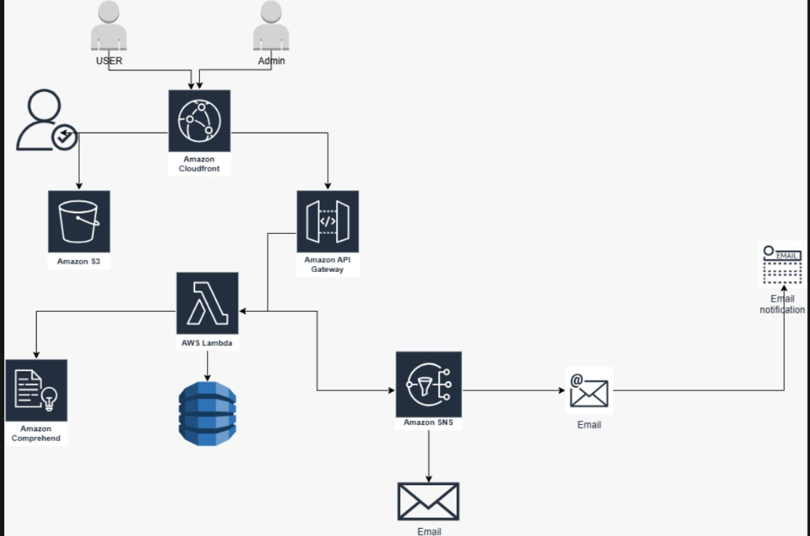
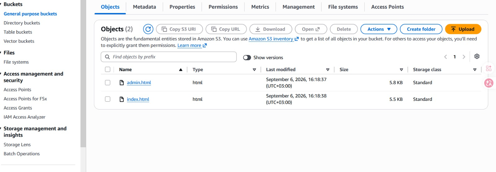
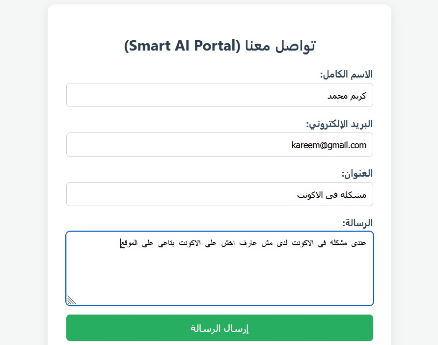
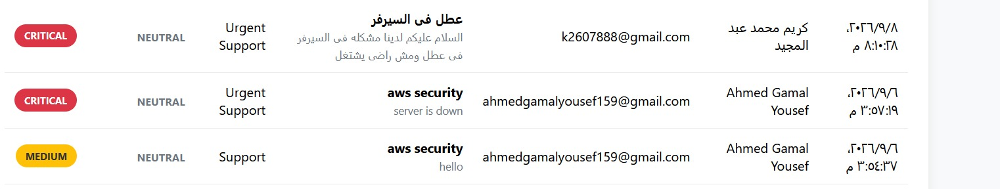
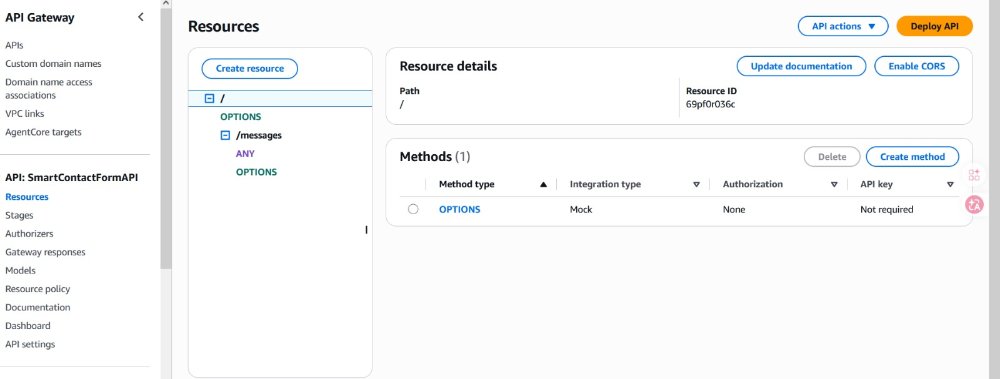

# AWS Serverless AI-Powered Contact Form System

A production-ready, highly available, secure, and scalable serverless contact form system built using AWS native services.

---

## 📐 System Architecture


---

## 🏗️ Technical Architecture Stack
- **Amazon S3:** Private Static Web Content Hosting protected via Origin Access Control (OAC).
- **Amazon CloudFront:** Global CDN for HTTPS acceleration & Edge Basic Auth via CloudFront Functions.
- **Amazon API Gateway:** Managed REST API endpoints, CORS configuration, and Throttling controls.
- **AWS Lambda (Python 3.12):** Serverless backend compute executing business logic and AI integration.
- **Amazon Comprehend:** Natural Language Processing (NLP) for real-time sentiment analysis.
- **Amazon DynamoDB:** Fully managed NoSQL data store operating on On-Demand capacity mode.
- **Amazon SNS:** Pub/Sub messaging system delivering prioritized email notifications.

---

## 🛠️ Step-by-Step Implementation & Console Verification

### Step 1: Storage & Frontend Web Hosting (Amazon S3)
Provisioned a private Amazon S3 bucket to store static web interface files (`index.html` and `admin.html`). Enforced `Block Public Access: ON` to prevent direct public access, ensuring all incoming traffic is strictly routed through CloudFront.



---

### Step 2: Content Delivery & Edge Security (Amazon CloudFront)
Configured a CloudFront Distribution with Origin Access Control (OAC) to securely serve S3 static content. Attached a custom CloudFront Function at the viewer request event to intercept calls to `/admin.html` and require HTTP Basic Authentication before serving the page.

| CloudFront CDN Setup | Basic Auth Edge Prompt |
| :---: | :---: |
|  |  |

| User Contact Form UI | Protected Admin Dashboard UI |
| :---: | :---: |
|  |  |

---

### Step 3: API Endpoint Orchestration & CORS (Amazon API Gateway)
Built a REST API with a `/messages` resource supporting `POST` and `OPTIONS` methods. Configured CORS headers and integrated Lambda Proxy Integration to pass incoming JSON payloads. Set up Throttling (Rate: 5 req/sec, Burst: 10) to mitigate DDoS and spam risks.



---

### Step 4: Compute Logic & Environment Configuration (AWS Lambda)
Deployed an AWS Lambda function using Python 3.12. Configured IAM execution policies granting minimal necessary permissions to access DynamoDB, SNS, and Comprehend. Externalized resource identifiers into Lambda Environment Variables (`TABLE_NAME`, `CRITICAL_SNS_ARN`, `GENERAL_SNS_ARN`).


---

### Step 5: AI Sentiment Analysis & Logic (Amazon Comprehend)
Integrated `boto3.client('comprehend')` inside the Lambda handler. The function sends the user's message body to Comprehend's `detect_sentiment()` API to analyze sentiment in real-time. If the sentiment is flagged as `NEGATIVE` or contains urgent keywords, the priority is elevated to `CRITICAL`.

```python
# Real-time Sentiment Analysis Execution
comprehend_res = comprehend.detect_sentiment(
    Text=message, 
    LanguageCode='en'
)
sentiment = comprehend_res.get('Sentiment', 'NEUTRAL')