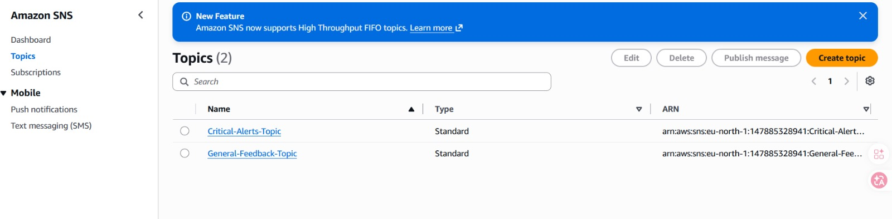

# AWS Serverless AI-Powered Contact Form System

A production-ready, highly available, secure, and scalable serverless contact form system built using AWS native services.

---

## 📐 System Architecture

---

## 📸 System Screenshots & AWS Console Proofs

### 1. Frontend & Edge Security (S3, CloudFront & Basic Auth)
| Public Contact Form | Basic Auth Protection | S3 Bucket Hosting |
| :---: | :---: | :---: |
|  |  |  |

| CloudFront CDN Distribution | Protected Admin Dashboard |
| :---: | :---: |
|  |  |

---

### 2. Backend Logic, AI Processing & Storage
| API Gateway REST Setup | Lambda Environment Variables |
| :---: | :---: |
|  |  |

| DynamoDB Live Records | Amazon SNS Topics |
| :---: | :---: |
|  |  |

---

## 🏗️ Architecture Stack & Best Practices
- **Amazon S3:** Private Static Web Content Hosting protected via OAC.
- **Amazon CloudFront:** Global CDN for SSL/HTTPS acceleration & Edge Basic Auth via CloudFront Functions.
- **Amazon API Gateway:** Managed REST API endpoints, CORS handling, and Throttling controls.
- **AWS Lambda (Python 3.12):** Serverless backend compute executing business rules and AI SDK calls.
- **Amazon Comprehend:** Automated Natural Language Processing (NLP) for real-time sentiment analysis.
- **Amazon DynamoDB:** Fully managed NoSQL store with On-Demand capacity mode.
- **Amazon SNS:** Pub/Sub alert system sending prioritized email notifications based on sentiment analysis.

---

## 🚀 Deployment Steps
1. Upload static files (`index.html`, `admin.html`) to your private S3 Bucket.
2. Setup Amazon CloudFront Distribution linked via Origin Access Control (OAC).
3. Create Amazon DynamoDB Table `ContactFormMessages` with Partition Key `MessageId`.
4. Deploy AWS Lambda function with proper IAM permissions to access Comprehend, DynamoDB, and SNS.
5. Create REST API on API Gateway and enable CORS before linking Lambda Proxy integration.